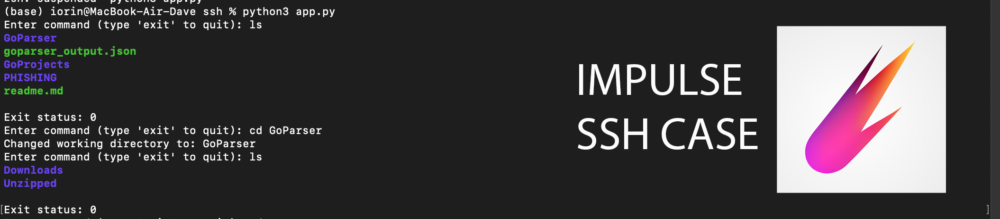

# SSHClient

## Описание

Этот проект представляет собой минималистичный класс на языке Python для работы с SSH. Он предоставляет возможность подключения к удаленному хосту, выполнения произвольных команд и получения вывода этих команд.

## Кейс от компании Байкал Электроникс

В данном проекте был выполнен кейс от компании Байкал Электроникс:

**Задача:**
Написать минималистичный класс на языке Python, который позволяет подключаться по SSH к удаленному хосту, выполнять на нем произвольные команды и получать их вывод.

**Условия и ограничения:**
- Не использовать сторонние обертки вроде paramiko или scrapli.
- Использовать стандартный модуль ssh2-python (обертка вокруг C библиотеки libssh2).
- Функция выполнения команды должна позволять менять рабочий каталог.
- Добавить раскраску вывода терминала с использованием ANSI escape кодов и парсер вывода с помощью регулярных выражений.

**Опционально:**
- Аутентификация на хосте может быть как с помощью пары логин — пароль, так и с помощью ключа.
- Отправка нескольких команд за один раз.
- Кроссплатформенность (Linux, Windows).

## Использование

1. ...

2. ...

## Зависимости

- [ssh2-python](https://github.com/ParallelSSH/ssh2-python)

## Лицензия

Этот проект лицензируется под [MIT License](LICENSE).

